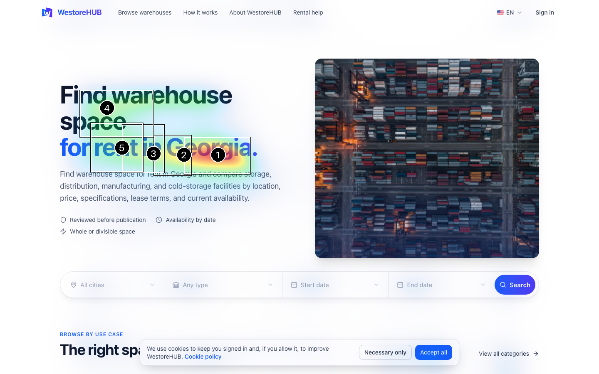

# gazemap

**Predict where people look first on a web page, screenshot, or PDF.** gazemap turns a
URL or a file into an attention heatmap, ranks the hotspots, and tells you which DOM
element or line of text sits under each one. It runs entirely on your machine with an
open-source saliency model and a location prior fitted on human eye tracking over UI
screenshots: free, offline, no API keys, no accounts. On held-out UI screenshots its top
hotspot lands where people actually looked two times in three
([benchmark](#accuracy-measured-against-human-eye-tracking)).

[](LICENSE)
[](pyproject.toml)
[](#runtime)
[](#models-and-licenses)



```
$ uv run gazemap analyze https://westorehub.com --viewport both
loaded deepgaze2e on mps in 2.5s
https://westorehub.com [desktop 1440x900, above the fold] deepgaze2e on mps, centerbias mit1003: capture 1.6s, inference 1.5s
   1   11.9%  span h1.text-4xl > span.block.bg-gradient-to-r "for rent in Georgia."
   2    4.7%  span h1.text-4xl > span.block.bg-gradient-to-r "for rent in Georgia."
   3    5.0%  span h1.text-4xl > span.block.bg-gradient-to-r "for rent in Georgia."
   4    8.6%  h1 div.mx-auto.grid > div:nth-of-type(1) > h1.text-4xl "Find warehouse space for rent in Georgia."
   5    4.4%  span h1.text-4xl > span.block.bg-gradient-to-r "for rent in Georgia."
  -> runs/westorehub.com/desktop/overlay.png
  report: ~/Desktop/gazemap-reports/westorehub.com.html
```

## What it does

- **Attention heatmap for any URL**, live site or `localhost`, on a desktop (1440x900) and
  a mobile (390x844) viewport.
- **Ranked hotspots** with the share of predicted attention each one holds, mapped to the
  DOM element under it: tag, a short CSS selector, and its visible text. You learn *what*
  draws the eye, not only where.
- **Full-page analysis**, screen by screen, for long landing pages.
- **PDFs and images**: a resume, a poster, a screenshot. Hotspots report the text lines
  under them from the PDF text layer.
- **A self-contained HTML report** per page: overlays, hotspot tables, attention totals per
  element, and a desktop-versus-mobile comparison.
- **A measured answer for one element**: `--target "#cta"` reports the share of attention
  inside your call to action, before and after a change.
- **Before and after**: `compare` puts two runs side by side and reports the change in
  each target's share.
- **Try a redesign without touching code**: `--css tweaks.css` injects styles before
  capture, so a change is measured in seconds.
- **Machine-readable output** (`hotspots.json`) and three Claude Code skills: `/gaze-review`
  turns the numbers into a critique with prioritized fixes, `/gaze-improve` iterates on
  CSS until the main elements win the first look, and `/gaze-fix` ports the winner into
  the codebase on a branch and proves it with the numbers.

## Why gazemap

Attention-prediction heatmaps are usually sold as a subscription, and the pages you want
to check are often unreleased or on `localhost`. gazemap gives you the same kind of
first-glance signal from a published research model, locally, with the DOM mapping that
a screenshot-only service cannot provide.

The heatmap never comes from a language model. Asking a vision-language model "where
would a user look?" produces confident prose but does not reproduce measured first
fixations. gazemap uses [DeepGaze IIE](https://github.com/matthias-k/DeepGaze), a
fixation-prediction model trained on eye-tracking data, and keeps any AI critique as a
separate, optional layer on top of the numbers.

## Quick start

Tested on macOS with Apple Silicon, where PyTorch uses the MPS device. The CPU fallback
should run on Linux and Windows but is untested there.

```bash
git clone https://github.com/noopntr/gazemap.git
cd gazemap
uv sync
uv run playwright install chromium
uv run gazemap analyze https://example.com --viewport both
```

Requires [uv](https://docs.astral.sh/uv/). Python 3.12 is pinned in `.python-version`
and uv fetches it if needed. The first run downloads the DeepGaze IIE checkpoint (420 MB)
and the MIT1003 centerbias (8 MB) into `models/`, which is gitignored. Set
`GAZEMAP_MODEL_DIR` to keep them elsewhere. If a download fails, the error prints the URL
and the target path so you can fetch the file by hand.

## Usage

```bash
uv run gazemap analyze <url or file> [options]
```

| Option | Default | Meaning |
|---|---|---|
| `--viewport desktop\|mobile\|both` | `desktop` | Desktop is 1440x900, mobile is 390x844 with a phone user agent and touch. Both use device pixel ratio 1. |
| `--full-page` | off | Analyze the whole page screen by screen instead of the first viewport only. |
| `--max-screens N` | `20` | Cap on screens per viewport in full-page mode. |
| `--wait MS` | `0` | Extra wait after the load event, for pages that render late. |
| `--hide SELECTOR` | | CSS selector to hide before capture. Repeatable. Use it for cookie banners and chat widgets. |
| `--centerbias ueyes\|mit1003\|uniform` | `ueyes` | Prior over fixation locations. `ueyes` is fitted on eye tracking over UI screenshots and favours the top left; `mit1003` is DeepGaze's photograph prior and favours the center; `uniform` removes the prior. |
| `--css FILE` | | Stylesheet injected before capture, to try a design change without editing the site. Repeatable. |
| `--top N` | `5` | Number of hotspots. |
| `--device auto\|mps\|cpu` | `auto` | `auto` picks MPS when available. |
| `--out DIR` | `runs` | Output root. |
| `--report-dir DIR` | `~/Desktop/gazemap-reports` | Where the HTML report is written. |
| `--no-report` | off | Skip the HTML report. |
| `--timeout MS` | `30000` | Navigation timeout. |
| `--target SELECTOR` | | Measure the attention share inside an element's box. CSS or Playwright selector, repeatable, web pages only. |

Local dev servers work the same way: `uv run gazemap analyze http://localhost:3000`.

### Outputs

Each run writes to `runs/<page-slug>/<viewport>/` and overwrites what was there. The
slug is the host, port, and path of the URL, so `http://localhost:3000/pricing` becomes
`runs/localhost-3000-pricing/desktop/`.

| File | Content |
|---|---|
| `screenshot.png` | The captured page. |
| `heatmap.png` | Grayscale attention map, 255 at the strongest point. |
| `overlay.png` | Heatmap blended over the screenshot. Blend strength follows attention, so quiet areas show the page as is. Hotspots are boxed and numbered by rank. |
| `hotspots.json` | Everything below. |

`hotspots.json` records the URL, final URL after redirects, HTTP status, capture
warnings, viewport, model, centerbias, device actually used, capture mode with page
height and screen count, and runtime in seconds. Each hotspot has:

- `rank`: 1 is the highest peak.
- `center`: peak pixel in screenshot coordinates.
- `bbox`: extent of the region around the peak that stays above half the peak value.
- `share`: fraction of the page's total predicted attention inside that region.
- `peak`: peak height relative to the strongest hotspot.
- `screen`: which viewport-height screen the peak is on, counted from 1.
- `element`: `tag`, a short CSS `selector`, and trimmed visible `text` of the topmost DOM
  element at the center, from `document.elementFromPoint` in the same browser session.
  For PDFs, `tag` is `text` and `text` holds the lines under the hotspot. `null` when
  nothing is there.

Hotspots are ranked by peak height, the model's best guess at where the eye lands first.
A broad, softer region can hold a larger `share` than a sharper peak ranked above it.
Both numbers are reported so you can use whichever fits the question.

### Measuring one element

```bash
uv run gazemap analyze https://example.com --viewport both --target "#signup" --target 'button:has-text("Search")'
```

`--target` answers "does my call to action get attention?" with a number instead of a
guess. Each target is located in the same browser session, its box is recorded, and the
share of predicted attention inside that box is written to `targets` in `hotspots.json`,
along with the ranks of any hotspots whose peak falls inside it. Any CSS selector works,
and so do Playwright's text and role selectors. A target that cannot be found is
reported as such rather than estimated. This is the number an AI or human reviewer
should quote, and the number to compare before and after a change.

### Full page

```bash
uv run gazemap analyze https://example.com --viewport both --full-page
```

The model needs a single view at roughly the scale it was trained on, so a tall page
cannot go in as one image: a 4000 px page shrunk to 1024 px would turn every headline
into a few pixels. Instead the page is scrolled once so lazy content loads, captured in
full, and cut into viewport-height screens. Each screen is predicted on its own, with
its own center bias, and the maps are stitched with equal weight per screen. Fixed
elements such as cookie banners appear once, in the first screen. `share` becomes a
fraction of the whole page with screens weighted equally, so shares are smaller than in
above-the-fold runs.

### PDFs and images

```bash
uv run gazemap analyze ~/Documents/resume.pdf
uv run gazemap analyze screenshot.png
```

A `.pdf`, `.png`, `.jpg` or `.webp` path works in place of a URL. Each PDF page is rendered
at 150 dpi and analyzed as one view; outputs go to `runs/<file-name>/page-1/` and so on,
images to `runs/<file-name>/image/`. Hotspots report the text lines under them from the
PDF text layer. Images have no text layer, so `element` is `null`. The viewport,
full-page, wait, hide, target, and css options do not apply.

On a resume, gazemap answers a layout question: does the name dominate, or does a photo,
an icon column, or a colored sidebar steal the first look? It does not model a recruiter,
who scans top-left down for a title, a company, and dates. Two-column layouts list both
columns' lines under a hotspot.

### Before and after

```bash
uv run gazemap analyze http://localhost:3000 --viewport both --target "#cta" --out compare/before
# change the page
uv run gazemap analyze http://localhost:3000 --viewport both --target "#cta" --out compare/after
uv run gazemap compare compare/before/localhost-3000 compare/after/localhost-3000
```

`compare` pairs the viewports of two runs and writes, per viewport, a side-by-side image of
the two overlays with the target boxes marked and the shares in the header, plus
`compare.json` with each target's share before, after, and the change in points, and the
top hotspots on both sides. Same server, same flags, same targets on both sides, or the
numbers are not comparable.

### Report

Every run writes a self-contained HTML report to `~/Desktop/gazemap-reports/`, one file
per page slug, images embedded, overwritten on re-run. It lists the hotspots, the total
attention per element, and the elements that draw attention in every viewport, and it
states how to read the numbers. It does not critique the design; that is a job for a
reviewer, human or AI, reading the report.

### Exit codes

`0` success, `2` the page or file could not be loaded (unreachable host, connection
refused, timeout, TLS problem, missing file), `3` a model file could not be downloaded.
HTTP errors and bot challenges do not abort a run: the page is captured anyway and a
warning is printed and saved, because a 403 page can still be worth looking at.

## How it works

1. **Capture.** Playwright drives headless Chromium at the requested viewport. It waits
   for the load event, then for network idle up to 10 s, then `--wait`. Hidden selectors
   are removed with an injected stylesheet. Animations are frozen for the screenshot.
2. **Saliency.** The screenshot is resized so its long side is 1024 px, the scale
   DeepGaze was trained at (MIT1003 images at about 35 px per degree of visual angle).
   The location prior, a log density, is rescaled to the same size and renormalized.
   DeepGaze combines it with what it sees and returns a log density, which is turned into
   a probability map and resized back to screenshot size, renormalized to sum to 1.
3. **Hotspots.** Greedy non-maximum suppression over local maxima. Peaks within 5% of
   the long side of an earlier peak, or below 5% of the global maximum, are dropped.
   Every pixel is then assigned to the local maximum it reaches by steepest ascent, and
   maxima that were suppressed count as part of the hotspot that suppressed them. A
   hotspot's region is the connected part of its own basin that stays above half its
   peak, so regions never overlap or enclose another hotspot. Candidates whose region
   holds under 1% of the attention are skipped in favour of the next peak.
4. **Mapping.** For each hotspot center the still-open page is asked for the element at
   that point, or the PDF text layer for the lines under it.
5. **Render and write.** Images, JSON, the terminal summary, and the report.

The model sits behind a small `SaliencyModel` protocol in `src/gazemap/saliency/`, so
another model can be added without touching the pipeline.

### About the DeepGaze loader

DeepGaze IIE is an ensemble of four ImageNet backbones with 30 small readout heads each.
The published checkpoint contains all backbone weights, but the upstream constructors
still download each backbone's original ImageNet weights first, from Bitbucket, a GitHub
release, and `torch.hub`, which stops at an interactive trust prompt. gazemap builds the
same architectures empty in `saliency/backbones.py` and loads the checkpoint with strict
key checking, so the only downloads are the checkpoint and the centerbias. DeepGaze is
pinned to tag v1.1.0, whose IIE code is identical to the current main branch but does not
require OpenAI CLIP.

## Accuracy, measured against human eye tracking

`gazemap benchmark` scores the model against [UEyes](https://zenodo.org/record/8010312)
(Jiang et al., CHI 2023): 62 people's eye movements on 1,980 screenshots of web pages,
desktop apps, mobile apps, and posters. Results below are on the dataset's held-out test
split (108 screenshots, 27 per type), against the fixations of the first 3 seconds.

| Configuration | CC | NSS | AUC-Judd | KLD (lower is better) | SIM | Top-1 hit |
|---|---|---|---|---|---|---|
| **DeepGaze IIE + UI prior (default)** | **0.491** | **1.20** | **0.797** | 1.09 | **0.471** | **67%** |
| DeepGaze IIE + photograph prior | 0.322 | 0.80 | 0.731 | 1.47 | 0.391 | 41% |
| DeepGaze IIE, no prior | 0.394 | 0.98 | 0.742 | 1.28 | 0.411 | 49% |
| UI prior alone, image ignored | 0.433 | 1.00 | 0.766 | **1.08** | 0.427 | 42% |
| Photograph prior alone | 0.120 | 0.29 | 0.582 | 2.01 | 0.309 | 17% |

Top-1 hit is the share of screenshots where gazemap's rank-1 hotspot lies in the 10% of
the screen that drew the most human attention; it is the number that matters most for a
tool that says "this is what people see first". Per UI type, with the default:

| Type | CC | NSS | Top-1 hit |
|---|---|---|---|
| Web pages | 0.468 | 1.19 | 59% |
| Desktop apps | 0.474 | 1.24 | 70% |
| Mobile apps | 0.505 | 1.25 | 70% |
| Posters | 0.516 | 1.14 | 67% |

What the numbers say:

- **The prior matters as much as the model.** DeepGaze's own prior was fitted on
  photographs, where people look at the center. People look at interfaces from the top
  left, as the UEyes authors found, so that prior points the wrong way: it makes
  DeepGaze worse than using no prior at all. gazemap therefore ships a prior fitted on
  the UEyes training split (1,870 screenshots, no test data) and uses it by default.
- **Location explains a lot, content decides the winner.** The UI prior alone, which
  never looks at the image, correlates with human attention almost as well as the full
  model. What DeepGaze adds is picking the right element: the top-1 hit rate goes from
  42% to 67%.
- **It is a strong hint, not ground truth.** One time in three the predicted first
  hotspot is not where people looked. Use gazemap to compare designs and catch buried
  calls to action, and confirm important decisions with real users.

Reproduce it:

```bash
uv run gazemap benchmark --download            # test split, about 50 MB, about 5 minutes on MPS
uv run gazemap benchmark --download --split all
```

Only the needed files are read out of the 12.9 GB archive with HTTP range requests,
throttled to stay under Zenodo's rate limit. Per-image scores land in
`runs/benchmark/results.json`. The benchmark and the prior are evaluated on UEyes' own
screenshots, which were shown whole on a monitor; gazemap's captures are browser
viewports, which is close but not identical.

## Runtime

Measured on a MacBook Pro M4 Pro (24 GB) with the Wikipedia home page.

| | Model load | First inference | Warm inference per page |
|---|---|---|---|
| MPS, desktop 1440x900 | 2.9 s | 2.6 s | 0.56 s |
| MPS, mobile 390x844 | | 1.2 s | 0.49 s |
| CPU, desktop 1440x900 | 1.2 s | 1.4 s | 1.33 s |
| CPU, mobile 390x844 | | 1.3 s | 1.27 s |

The first MPS call per input shape pays for kernel compilation. Capture adds about 1.2 s
per viewport, including the browser launch. A single page takes a few seconds end to end
on either device. Full page on a 4200 px desktop page (5 screens) and a 7700 px mobile
page (10 screens), both viewports plus the report: 23 s wall clock on MPS. If an MPS op
fails, the run retries on CPU and says so.

## Accuracy and limitations

- **DeepGaze is trained on photographs, not interfaces.** The UI prior corrects where it
  looks, not what it recognizes: it has no notion of a button, a price, or a logo as
  such. See the [benchmark](#accuracy-measured-against-human-eye-tracking) for how often
  that matters: the top hotspot matches human attention about two times in three.
- **One view at a time.** The model predicts first fixations on a single view. Full-page
  mode analyzes each screen as if the viewer had just scrolled there, which ignores
  everything they saw on the way.
- **Top-left prior.** The default prior gives elements near the top left a head start,
  because that is where people start on interfaces. Compare with `--centerbias uniform`
  when an element far from the top left seems under-rated.
- **No reading order, no intent.** A saliency model does not know that readers start
  top-left or that they are looking for a price. It answers "what pops", not "what gets
  read".
- **Mobile scaling.** Mobile screenshots are upscaled to 1024 px on the long side, the
  same rule as desktop. At a phone's viewing distance the native width is already close
  to the training scale, so this is a judgment call; the constant is
  `DeepGazeIIE(long_side=...)`.
- **Headless detection.** Some sites serve a challenge page or a 403 to headless
  browsers. The run continues with a warning; check `http_status` and `warnings` in the
  JSON before trusting the result.
- **DOM mapping picks the topmost element.** Overlays, transparent wrappers, and text
  spans inside buttons are reported as they are.

## FAQ

**Is this eye tracking?** No. Eye tracking measures real people. gazemap predicts where
first fixations are likely to land, using a model and a prior fitted on eye-tracking
datasets, and it is scored against real eye tracking on UIs in the
[benchmark](#accuracy-measured-against-human-eye-tracking). It is a fast, free proxy for a
first-impression test, not a replacement for one.

**Does it work offline?** Yes, after the first run has downloaded the model files and
Chromium. Live URLs need network access, `localhost` and files do not.

**Does it send my pages anywhere?** No. Capture, inference, and reporting all happen on
your machine.

**Can I use it for commercial work?** gazemap's own code is MIT licensed. The DeepGaze
IIE code and weights it downloads carry no explicit license from their authors, and the
backbone weights inside the checkpoint come from several research groups. Check the
[Models and licenses](#models-and-licenses) table and decide for your own situation.

**Why not just ask an AI model to look at the screenshot?** Because it will guess. A
saliency model trained on fixation data is the right tool for "where do eyes land";
a language model is the right tool for explaining why and proposing fixes, once it has
the numbers.

**Can I plug in another model?** Yes. Implement the `SaliencyModel` protocol in
`src/gazemap/saliency/__init__.py` and register it in `load_model()`. UMSI, which was
trained on graphic designs rather than photographs, is the natural next candidate.

## AI design review with `/gaze-review`

The repository ships a [Claude Code](https://claude.com/claude-code) skill in
`.claude/skills/gaze-review/`. Open the checkout in Claude Code and run:

```
/gaze-review https://example.com
```

It runs gazemap on both viewports, looks at the overlays, asks you what a first-time
visitor should look at first (the call to action, the headline, the product), measures
that element with `--target`, and writes `runs/<page-slug>/review.md` with a verdict
table per viewport, what steals attention and why (contrast, size, faces, position,
clutter, isolation), and three to six prioritized fixes, each tied to a hotspot by rank,
element, and share, plus the command to verify them after the change. A copy lands next
to the HTML reports in `~/Desktop/gazemap-reports/`.

The split is deliberate: the saliency model supplies the numbers, the language model
supplies the interpretation, and every claim in the review has to point at a number.

### Measured redesigns with `/gaze-improve`

```
/gaze-improve https://example.com
```

The third skill, in `.claude/skills/gaze-improve/`, reworks the design in a measurement
loop without touching any code. It takes the goal from `review.md` (or asks), measures a
baseline, then tries one design idea at a time as a stylesheet injected with `--css`,
keeps an idea only if the target's share rises and the page's other key elements keep
at least two thirds of theirs, and stops when the target holds a top-3 hotspot on every
viewport or after six attempts. Hiding or shrinking competitors is not allowed: only
size, weight, colour from the page's palette, contrast, spacing, order, and position. The
result is `improve.md` with every attempt and its numbers, the side-by-side overlays,
and `best.css` as the spec for `/gaze-fix`.

On westorehub.com, with the search bar as the goal, six attempts took the bar from 0.1%
to 6.2% of predicted attention on mobile, where its Search button entered the top three,
and from 2.3% to 5.2% on desktop, where the headline still wins.

### Verified fixes with `/gaze-fix`

```
/gaze-fix http://localhost:3000 ~/code/my-site
```

The second skill, in `.claude/skills/gaze-fix/`, takes the top suggestion from
`review.md` and proves it. It measures the page on your dev server, finds the element in
the repository, proposes the smallest diff that implements the suggestion, and stops
until you say yes. Then it creates a `gaze-fix/<name>` branch, applies the change without
committing, re-runs gazemap with the same flags, runs `compare`, and writes `fix.md` with
the before and after shares per viewport, the diff, and the side-by-side overlays. A
change that does not move the target's share is reported as such, with a revert command.

To use the skills from any project, link or copy the folders into `~/.claude/skills/`
and set `GAZEMAP_HOME` to the checkout.

## Roadmap

- A per-project spec file and `gazemap check`, which fails when a main element's share
  drops below its threshold, for CI.
- Installation as a tool (`uvx gazemap`) and CI for the unit tests.
- A UI-trained saliency model such as UMSI++, now that the benchmark can show whether it
  beats DeepGaze with the UI prior.

## Models and licenses

gazemap does not ship any model weights. It downloads them from their authors' releases
on first run. The gazemap code itself is MIT licensed; each component below keeps its own
terms.

| Component | Source | License |
|---|---|---|
| DeepGaze IIE code and checkpoint | [matthias-k/DeepGaze](https://github.com/matthias-k/DeepGaze), tag v1.1.0 | No license file in the repository and the MIT classifier in its `setup.py` is commented out. Research code published with the paper: Linardos, Kümmerer, Press, Bethge, *Calibrated prediction in and out-of-domain for state-of-the-art saliency modeling*, ICCV 2021. |
| MIT1003 centerbias (optional prior) | Same release | Derived from the MIT1003 eye-tracking dataset (Judd et al. 2009). No explicit license. |
| UI prior `centerbias_ueyes.npy` (default) | Fitted from the [UEyes](https://zenodo.org/record/8010312) training split, shipped in this repository | CC BY 4.0, derived from UEyes by Jiang, Leiva, Tavakoli, Houssel, Kylmälä, Oulasvirta (CHI 2023). See `NOTICE`. |
| UEyes dataset (benchmark only, downloaded on demand) | [Zenodo record 8010312](https://zenodo.org/record/8010312) | CC BY 4.0 |
| ShapeNet-C backbone weights | [rgeirhos/texture-vs-shape](https://github.com/rgeirhos/texture-vs-shape), redistributed inside the checkpoint | No license for code or weights in that repository; it only ships a `DATASET_LICENSE` for its stimuli. Research weights from Geirhos et al., ICLR 2019. |
| EfficientNet-B5 backbone code and weights | [lukemelas/EfficientNet-PyTorch](https://github.com/lukemelas/EfficientNet-PyTorch), vendored in DeepGaze | Apache-2.0 |
| DenseNet201 and ResNeXt50 backbone weights | torchvision | BSD-3-Clause |
| PyTorch, torchvision | | BSD-3-Clause |
| NumPy, SciPy, boltons | | BSD-3-Clause |
| Pillow | | MIT-CMU |
| pypdfium2 (PDFium) | | BSD-3-Clause and Apache-2.0 |
| Playwright, Chromium | | Apache-2.0, BSD-3-Clause |

If you use gazemap in published work, cite DeepGaze IIE and, for the UI prior or the
benchmark, UEyes:

```bibtex
@inproceedings{linardos2021calibrated,
  title     = {Calibrated prediction in and out-of-domain for state-of-the-art saliency modeling},
  author    = {Linardos, Akis and K{\"u}mmerer, Matthias and Press, Ori and Bethge, Matthias},
  booktitle = {Proceedings of the IEEE/CVF International Conference on Computer Vision (ICCV)},
  year      = {2021}
}

@inproceedings{jiang2023ueyes,
  title     = {UEyes: Understanding Visual Saliency across User Interface Types},
  author    = {Jiang, Yue and Leiva, Luis A. and Rezazadegan Tavakoli, Hamed and Houssel, Paul R. B. and Kylm{\"a}l{\"a}, Julia and Oulasvirta, Antti},
  booktitle = {Proceedings of the 2023 CHI Conference on Human Factors in Computing Systems},
  year      = {2023}
}
```

## Development

```bash
uv run pytest                  # 91 tests, about 55 s with weights and Chromium present
uv run pytest -m "not smoke"   # unit and capture tests only, no model needed
```

Unit tests cover normalization, coordinate mapping, map stitching, peak extraction with
suppression, rendering, full-page capture and DOM lookup against fixture pages served
locally, PDF and image loading with text lookup, report generation, and CLI output. The
smoke tests run the real model on a plain page with one red button and assert the top
hotspot lands on it in both viewports. Model tests skip when the weights are not
downloaded. Tests never write to the real Desktop.

```
src/gazemap/
  cli.py                  argument parsing, pipeline, terminal summary
  capture.py              Playwright session, screenshots, screens, elementFromPoint
  document.py             PDF pages and images as views, text under a rectangle
  maps.py                 log density -> probability, resizing, stitching
  hotspots.py             peaks, suppression, regions, attention share
  render.py               heatmap and overlay images
  report.py               self-contained HTML report
  compare.py              before/after deltas and side-by-side overlays
  benchmark.py            scoring against human eye tracking, baselines
  metrics.py              AUC-Judd, NSS, CC, KLD, SIM, top-1 hit
  datasets.py             UEyes: partial download from the remote zip
  priors.py               fitting and loading fixation priors
  saliency/__init__.py    SaliencyModel protocol and load_model()
  saliency/deepgaze.py    DeepGaze IIE: downloads, device, prediction
  saliency/backbones.py   backbone architectures rebuilt without downloads
```

Issues and pull requests are welcome. If you add a model, keep it behind `load_model()`
so the CLI and the outputs stay the same.

## License

[MIT](LICENSE) for gazemap's code. The UI prior file is derived from UEyes and shared
under CC BY 4.0, see [NOTICE](NOTICE). Third-party models and libraries keep their own
licenses, listed above.
